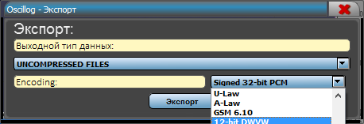

## **Экспорт**

{width="4.770833333333333in"
height="1.6354166666666667in"}

Текущую реализацию можно экспортировать в различные форматы, для этого
существует горячие клавиши «CTRL+SHIFT+E».

Необходимо выбрать тип сохраняемых контейнеров

{width="4.770833333333333in"
height="1.6354166666666667in"}

Далее выбрать кодирование:

{width="4.770833333333333in"
height="1.6354166666666667in"}{width="4.770833333333333in"
height="1.6354166666666667in"}
