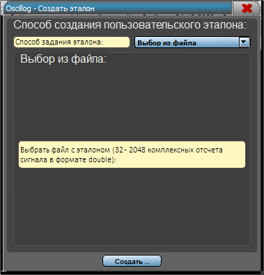
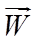

> **Корреляционный анализ**

Обычно спектрально-временной анализ -- это первый этап радиотехнического
анализа. Далее необходимо использовать специфические признаки сигналов.
В ВЧ и СВЧ диапазоне есть ряд сигналов, которые передают информацию
блоками. В начале каждого блока используются так называемые
«трайнинги» - детерминированные последовательности. Оптимальным подходом
для анализа сигналов с такими последовательностями является
корреляционный анализ. Корреляционный анализ позволяет решать задачи
обнаружения и разрешения сигналов. Корреляционная функция также
позволяет получить оценки неизвестных параметров, например, частоты или
времени.

Одной из основных проблем при приеме и анализе сигналов ВЧ диапазона
является проблема качества. Наиболее мощным подходом для повышения
качества является разнесенный прием. При решении задач радиотехнического
анализа применение адаптивных антенных систем является единственным
способом реализовать разнесенный прием. Так как в сигналах присутствуют
синхровставки, наиболее мощным критерием эффективности ААС является
критерий минимума среднеквадратической ошибки (МСКО). Разработанная
программа позволяет анализировать как одноканальные, так и
многоканальные сигналы. При анализе многоканальных сигналов производится
предварительное взвешивание сигналов ААС, работающей по критерию МСКО.

Трайнинги при анализе выступают в качестве эталонных
последовательностей.

Модуль корреляционного анализа позволяет анализировать форму
корреляционного отклика, во временной и частотных областях и позволяет
оптимизировать параметры алгоритмов обнаружения и различения.
Одноканальные реализации исследуются с помощью быстрой или медленной
корреляции. Использование ААС для анализа многоканальных сигналов
позволяет значительно повысить качество принимаемого сигнала и увеличить
отношение сигнал-помеха-шум, что представляет большой интерес в
условиях, когда приемная антенна расположена не оптимально по отношению
к линии связи и сигнал принимается с малым отношением сигнал-шум и
наличием помех

Для того, чтобы начать корреляционный анализ необходимо нажать на
«Корреляционный анализ» либо на клавиатуре «**CTRL+K**» или
«**CTRL+2**»:

{width="11.072916666666666in"
height="4.802083333333333in"}

**На рисунке:**

**Правая** форма отображает зависимость коэффициента корреляции от
времени, построенного в окрестности точки на сонограмме, на которую
указывает маркер.

**Левая** форма-- зависимость коэффициента корреляции от частоты, т.к.
точное значение несущей частоты сигнала априорно может быть не известно.
В процессе анализа происходит определение временной позиции и несущей
частоты сигнала. Уточненная частота отображается на нижнюю форму.

Для начала работы с данным модулем необходимо выбрать эталон для
радиотехнического анализа -- для этого необходимо кликнуть на «**Выбор
эталона**»:

{width="7.84375in"
height="5.958333333333333in"}

Раздел выбора эталона

Для корреляционного анализа реализован набор эталонных
синхропоследовательностей множества современных стандартов связи ВЧ
диапазона, помимо использования стандартных эталонов программа
представляет пользователю возможность расширения набора эталонов за счет
добавления пользовательских. Раздел «Пользовательские эталоны» -
формируются пользователем через раздел «Добавить новый эталон». Добавить
свой эталон можно 3 способами:

1.  Заданием СКК

{width="3.9479166666666665in"
height="4.114583333333333in"}

2.  Выбор из сонограммы -- для этого нужно выйти из меню выбора эталона,
    выделить требуемый участок на сонограмме, зайти обратно в раздел
    выбора эталона из сонограммы и подредактировать количество отсчетов
    (отобразится количество выделенных на сонограмме)

> {width="12.802083333333334in"
> height="10.385416666666666in"}

3.  Выбор из файла (бинарный файл с отсчетами формата double):

> {width="3.9479166666666665in"
> height="4.114583333333333in"}
>
> Сохранение эталона для трех способов создания эталона имеет одинаковый
> вид.
>
> {width="3.5833333333333335in"
> height="2.3333333333333335in"}
>
> Для работы с модулем Корреляционного анализа необходимо выбрать
> эталон:
>
> {width="7.84375in"
> height="5.958333333333333in"}
>
> Выбрали MilStd_train_d. Имеется возможность задать начало эталона и
> длину, а также изменить количество отсчетов на символ. После выбора
> эталона становится возможным проведение корреляционного анализа. При
> анализе неизвестной реализации важно правильно задать «Интервал
> анализа». При наличии пика происходит дополнительный анализ --
> происходит апроксимация и уточнение частоты смещения пика от эталона,
> определение максимума. Имеется возможность сдвинуть по частоте
> несущую.
>
> Доступно 3 алгоритма анализа:

-   Медленная корреляция -- для одноканальных реализаций (через
    скалярное произведение)

-   Быстрая корреляция - для одноканальных реализаций (через БПФ)

-   Виннер-Хопф - для многоканальных и одноканальных реализаций (при
    одноканальных вырождается в Быструю корреляцию)

> {width="19.428472222222222in"
> height="10.389583333333333in"}

Из данного изображения видно, что реализация с эфира сдвинута на 2,6 ГЦ,
данная реализация -- MilStd. Справа первый график -- корреляционный
отклик в позиции маркера на сонограмме (в данном случае вектор
многоканальной корреляции).

Справа второй график -- зависимость пика корреляционной функции (пика
корреляционного отклика справа снизу) от сдвига по частоте.

В процессе происходит анализ сдвига по частоте сигнала от эталона --
данное значение аппроксимируется параболической функцией и отображается
в «**Уточненная частота**». При этом значение максимального пика
отображается в «**Максимум**»

> Любая из осей любого графика кликабельна и обрабатывает события колеса
> мыши, а также drag-and-drop клики.
>
> {width="10.427083333333334in"
> height="4.802083333333333in"}
>
> Для исследования влияния сдвига по частоте на корреляционную функцию
> имеется возможность сдвинуть по частоте эталон, изменив «**Сдвиг
> несущей**». Также для исследования эталона на корреляционный отклик
> имеется возможность задать **длину** эталона и **отступ** от начала
> эталона или **сопрячь** эталон перед использованием.

**Теория по Корреляционному анализу:**

** **

**Корреляционный анализ**

** **

Корреляционный анализ наряду со спектральным играет большую роль в
теории сигналов. Говоря кратко, его смысл состоит в количественном
измерении степени сходства различных сигналов. Для этого служат
корреляционные функции.

Все схемные и программные решения корреляционных обнаружителей одиночных
сигналов связаны с формированием корреляционного интеграла (1.2).

{width="1.6354166666666667in"
height="0.6458333333333334in"} (1.2)

где
{width="4.489583333333333in"
height="0.5208333333333334in"} - опорный сигнал.

 

Корреляционный анализ применяется в комплексах ВЧ диапазона и позволяет
решить ряд задач оптимального приема, например, распознавание сигнала,
различение сигналов. Корреляционный анализ распространяется как на
одноканальные реализации, так и многоканальные (уравнение Винера-Хопфа).

Инструментов для «наглядного» корреляционного анализа не существует.

** **

**Разнесенный прием**

** **

Основные факторы, негативно влияющие на качество приема, являются
производными аддитивных и мультипликативных помех. К ним можно отнести:

> •       Недостаточное ОСПШ (отношение сигнал -- помеха + шум) на входе
> приемника (слабая слышимость канала)
>
> •       Влияние аддитивных помех различного происхождения (импульсные,
> станционные, природные, индустриальные, преднамеренные)
>
> •       Многолучевое распространение электромагнитной волны,
> межсимвольная интерференция

Методы организации параллельных каналов на передающей стороне:

> •       Чередование во времени («повтор сигнала»)
>
> •       Разнесение частот
>
> •       Разнесение по пространству, поляризации

Основная идея методов борьбы с перечисленными негативными факторами
состоит в организации параллельных каналов передачи сигнала, несущего
одну и ту же информацию в надежде на то, что сигналы будут подвергнуты
отличным друг от друга искажениям и обработка нескольких копий одного и
того же сигнала на приемной стороне позволит повысить верность приема.

С точки зрения организации РР и решения задачи осуществления
электромагнитного доступа к системам связи, особый интерес представляет
разнесение по пространству (поляризации). Этот тип организации каналов
параллельного приема не требует взаимодействия с передающей стороной.
Этот способ повышения качества позволяет значительно увеличить шансы
достоверно принять полезный сигнал по сравнению с одноканальным
корреляционным приемником.

Данный способ организации приема носит название пространственно
(поляризационно) разнесенный прием (Разнесенный прием).

Процессор в ААС обеспечивает взвешивание входных сигналов, то есть их
умножение на определенный коэффициент (множитель) и последующее их
сложение.

Наиболее применяемые показатели качества:

> •       ОСШ -- критерий max ОСШ на выходе ААС
>
> •       МОСПШ -- критерий max ОСПШ на выходе ААС
>
> •       МСКО -- критерий min СКО сигнала на выходе ААС от эталона
>
> •       МВСМ -- критерий максимизации выходной суммарной мощности на
> выходе ААС

** **

**Критерий адаптации ААС --** правило, в соответствие с которым
осуществляется работа с показателем качества.

{width="0.3229166666666667in"
height="0.21875in"} - вектор входного наблюдения

Примем:

{width="1.34375in"
height="1.0729166666666667in"} - вектор столбец входного наблюдения

{width="1.34375in"
height="0.96875in"} - вектор весовых коэффициентов

Все обозначения комплексные.

Выходной сигнал ААС (1.3):

{width="4.09375in"
height="0.6666666666666666in"} (1.3)

Выходной сигнал также называется «взвешенным». Происходит фокусировка ДН
ААС.

** **

**Пространственная селекция сигнала на фоне шумов и помех. Уравнение
Виннера-Хопфа**

 

Когда в полосе приема присутствует сигнал, помехи и шум. Для решения
задачи селекции полезного сигнала на фоне шумов и помех воспользуемся
критерием МСКО сигнала на выходе адаптивной антенной решетки от сигнала
эталона.

{width="3.78125in"
height="2.09375in"}

Рисунок 1.8 -- ААС

e(t) -- мгновенное отклонение выходного сигнала от сигнала эталона

В общем случае сигнал эталона неизвестен, если бы он был известен,
терялся бы сам смысл в системе связи, так как на приемной стороне была
бы известна копия передаваемого сигнала, а, следовательно, и сообщение.

Использование критерия МСКО оправдано и возможно по двум причинам --
современные системы связи имеют структуру передаваемых сигналов,
содержащую детерминированные вставки -- последовательности, используемые
в системах связи для настройки оборудования. Поскольку на приемной
стороне трайнинги и ретрайнинги известны, то они могут быть использованы
в качестве эталонных сигналов для адаптации ААС по критерию МСКО.

С методической точки зрения, вывод уравнения Виннера -- Хопфа,
определяющего решение поставленной задачи и потенциальные характеристики
ААС, может быть наиболее просто получен на основе критерия МСКО.

{width="3.3333333333333335in"
height="0.4375in"} (1.4)

{width="5.114583333333333in"
height="1.1041666666666667in"} (1.5)

\- мгновенный квадрат ошибки

{width="4.208333333333333in"
height="0.6770833333333334in"} (1.6)

Вектор корреляции входных сигналов с эталоном

{width="2.9583333333333335in"
height="1.5104166666666667in"} (1.7)

{width="7.927083333333333in"
height="1.3958333333333333in"} (1.8)

{width="1.2395833333333333in"
height="0.5208333333333334in"} (1.9)

{width="6.03125in"
height="0.6770833333333334in"} - целевая функция (1.10)

Минимизируем полученную целевую функцию (то есть определим такой
{width="0.3645833333333333in"
height="0.4583333333333333in"}, который минимизирует средний квадрат
ошибки
{width="0.5520833333333334in"
height="0.4166666666666667in"})

Определим градиент целевой функции и приравняем его к нулю, получим
точку экстремума, так как в целевой функции выше квадратичной формы не
присутствует слагаемых, следовательно, точка экстремума, за счет того,
что
{width="0.4270833333333333in"
height="0.4270833333333333in"} положительно определена, является точкой
минимума.{width="3.71875in"
height="0.5104166666666666in"} (1.11)

{width="1.6458333333333333in"
height="0.5in"} - уравнение Виннера -- Хопфа. (1.12)

Полученный вектор, в котором градиент целевой функции обращается в нуль,
является точкой минимума многомерной параболы, так как
{width="0.375in"
height="0.375in"} определяющая квадратичную форму, является положительно
определенной (мощность сигнала не может быть отрицательной).

{width="1.6458333333333333in"
height="0.5in"} - Виннеровский вектор решения. (1.13)

Оптимальный Виннеровский вектор обеспечивает оптимальную по критерию
МСКО пространственную селекцию полезного сигнала на фоне шумов и помех
для заданной СПО и конфигурации АР.

Фундаментальным свойством уравнения Виннера -- Хопфа является то, что
Виннеровское решение инвариантно к ряду критериев, которые используются
для адаптации.

** **
