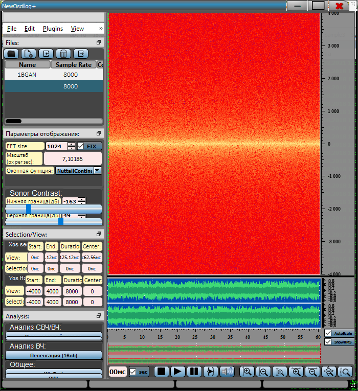

> **Генерация сигналов**
>
> В разделе меню Edit, имеется раздел **Generate**:
>
> {width="17.447916666666668in"
> height="10.375in"}
>
> Можно сгенерировать 4 вида сигналов:

-   Tone generate -- генерация различных тонов

> {width="4.40625in"
> height="1.7604166666666667in"}{width="4.40625in"
> height="1.7604166666666667in"}
>
> Например синусоида:
>
> {width="15.677083333333334in"
> height="5.572916666666667in"}

-   Chirp -- различного типа Chirp сигналы:

> {width="4.5in"
> height="1.9270833333333333in"}{width="4.5in"
> height="1.9270833333333333in"}
>
> {width="12.28125in"
> height="5.645833333333333in"}

-   Noise -- различные типы шумов (Белый, Розовый, Серый)

> {width="4.239583333333333in"
> height="1.2395833333333333in"}{width="4.239583333333333in"
> height="1.2395833333333333in"}
>
> White Brown Pink
>
> {width="4.9676793525809275in"
> height="5.400576334208224in"}{width="4.945097331583552in"
> height="5.404283683289589in"}{width="4.919375546806649in"
> height="5.3761734470691165in"}

-   Silence -- генерация тишины

> {width="4.40625in"
> height="0.8541666666666666in"}
