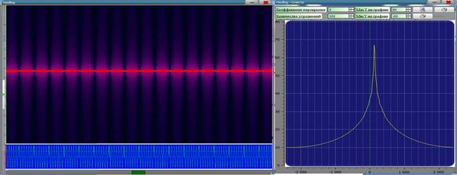

**Взвешивание многоканальных реализаций**

NewOscillog позволяет производить взвешивание сигнала не только в
процессе анализа, но также сохранять взвешенный файл улучшенного
качества для дальнейшего использования.

Для сигналов, имеющих в своем составе синхровставки -- трайнинги и
ретрайнинги возможно реализовать взвешивание по наиболее мощному
критерию -- МСКО, а для остальных сигналов -- по критерию МВСМ. Также
можно организовать взвешивание, сфокусировав антенную решетку в любом
направлении и отображать сонограмму, соответствующую выбранному азимуту
и углу места.

Для взвешивания необходимо нажать на «**МСКО/МВСМ**» или «CTRL+6»:

{width="4.791666666666667in"
height="3.3333333333333335in"}
{width="4.791666666666667in"
height="3.3333333333333335in"}

**Применение взвешивания по критерию МСКО, МВСМ и АРФ**

 

Часто в полосе полезного сигнала присутствуют различные помехи.
Случается, что ОСПШ не удовлетворяет требования демодулирующего
оборудования, тогда для качественного приема полезной информации
необходимо всеми возможными способами повысить ОСПШ: либо разрешить
полезный сигнал и помеху, либо взвесить многоканальную реализацию, либо
произвести суммарную корректировку после демодуляции.

В данном разделе рассматриваются способы повышения ОСПШ, такие как
взвешивание по критериям МСКО и МВСМ, а также пространственное
разрешение сигналов на примере взвешивания по критерию АРФ.

 

**Взвешивание по критериям МСКО и МВСМ.**

 

Данные виды взвешивания применимы **только для многоканальных (2 канала
и более)** реализаций.

 

Сформирована многоканальная помеха.

В качестве помехи используется синусоида с фазовой манипуляцией.

{width="6.756944444444445in"
height="2.6in"}

Синусоидальная помеха

**В качестве полезного сигнала выступает 4х канальная реализация сигнала
MilStd, записанная с эфира**

{width="6.485416666666667in"
height="2.8430555555555554in"}

Исходная реализация

 

**Исходная реализация сигнал+помеха.**

{width="6.485416666666667in"
height="2.8715277777777777in"}

Исходная реализация и помеха

У исходной реализации уровень помехи порядка 70дБ, уровень полезного
сигнала порядка 56дБ.

С помощью СПО «NewOscillog» была проведена «синхронизация» - определены
точные позиции «трайнингов», начала блоков, и частоты растройки
относительно эталона для сигнала MilStd.

**Реализация, взвешенная по критерию МСКО**

{width="6.485416666666667in"
height="2.7284722222222224in"}

Реализация, взвешенная по критерию МСКО

У взвешенной по критерию МСКО реализации уровень полезного сигнала
порядка 72дБ, помеха на спектре не видна. Взвешивание многоканальных
реализаций по критерию МСКО в некоторых случаях позволяет полностью
разрешить полезный сигнал и станционную помеху.

**Реализация, взвешенная по критерию МВСМ**

{width="6.5in"
height="2.9854166666666666in"}

Реализация, взвешенная по критерию МВСМ

У взвешенной по критерию МВСМ реализации уровень помехи порядка 70дБ,
уровень полезного сигнала порядка 65 дБ. Выигрыш ОСПШ составляет порядка
10дБ.

** **

**Разрешение сигналов по пространственным признакам. Взвешивание по
критерию АРФ.**

 

Данный вид взвешивания применим **только для 16-ти канальных**
реализаций.

Исходная 16ти канальная реализация Codan, записанная с эфира, на которую
воздействует аддитивная помеха.

{width="13.458333333333334in"
height="6.604166666666667in"}

Реализация и аддитивная помеха

По спектру видно, что помеха воздействует на сигнал и значительно
уменьшает ОСПШ. Благодаря взвешиванию по критерию АРФ можно «подобрать»
такую ДН антенной решетки, которая будет максимизировать сигнал и
минимизировать помеху, тем самым позволяя различить сигнал и помеху.

{width="17.270833333333332in"
height="10.34375in"}

Реализация, взвешенная по критерию АРФ

Как видно из спектрограммы были полностью разрешены два сигнала
«подбором» соответствующей ДН антенной решетки. При необходимости можно
различить любые два сигнала, если их пеленги различаются на величину
большую, чем величина разрешающей способности антенной решетки.

 

**Теория.**

**Корреляционный анализ**

 

Корреляционный анализ наряду со спектральным играет большую роль в
теории сигналов. Говоря кратко, его смысл состоит в количественном
измерении степени сходства различных сигналов. Для этого служат
корреляционные функции.

Все схемные и программные решения корреляционных обнаружителей одиночных
сигналов связаны с формированием корреляционного интеграла (1.2).

{width="1.3in"
height="0.5145833333333333in"} (1.2)

где
{width="3.1430555555555557in"
height="0.3715277777777778in"} - опорный сигнал.

 

Корреляционный анализ применяется в комплексах ВЧ диапазона и позволяет
решить ряд задач оптимального приема, например, распознавание сигнала,
различение сигналов. Корреляционный анализ распространяется как на
одноканальные реализации, так и многоканальные (уравнение Винера-Хопфа).

Инструментов для «наглядного» корреляционного анализа не существует.

 

**Разнесенный прием**

 

Основные факторы, негативно влияющие на качество приема, являются
производными аддитивных и мультипликативных помех. К ним можно отнести:

Недостаточное ОСПШ (отношение сигнал -- помеха + шум) на входе приемника
(слабая слышимость канала)

Влияние аддитивных помех различного происхождения (импульсные,
станционные, природные, индустриальные, преднамеренные)

Многолучевое распространение электромагнитной волны, межсимвольная
интерференция

Методы организации параллельных каналов на передающей стороне:

Чередование во времени («повтор сигнала»)

Разнесение частот

Разнесение по пространству, поляризации

Основная идея методов борьбы с перечисленными негативными факторами
состоит в организации параллельных каналов передачи сигнала, несущего
одну и ту же информацию в надежде на то, что сигналы будут подвергнуты
отличным друг от друга искажениям и обработка нескольких копий одного и
того же сигнала на приемной стороне позволит повысить верность приема.

С точки зрения организации РР и решения задачи осуществления
электромагнитного доступа к системам связи, особый интерес представляет
разнесение по пространству (поляризации). Этот тип организации каналов
параллельного приема не требует взаимодействия с передающей стороной.
Этот способ повышения качества позволяет значительно увеличить шансы
достоверно принять полезный сигнал по сравнению с одноканальным
корреляционным приемником.

Данный способ организации приема носит название пространственно
(поляризационно) разнесенный прием (Разнесенный прием).

Процессор в ААС обеспечивает взвешивание входных сигналов, то есть их
умножение на определенный коэффициент (множитель) и последующее их
сложение.

Наиболее применяемые показатели качества:

ОСШ -- критерий max ОСШ на выходе ААС

МОСПШ -- критерий max ОСПШ на выходе ААС

МСКО -- критерий min СКО сигнала на выходе ААС от эталона

МВСМ -- критерий максимизации выходной суммарной мощности на выходе ААС

 

Критерий адаптации ААС -- правило, в соответствие с которым
осуществляется работа с показателем качества.

{width="0.3284722222222222in"
height="0.21458333333333332in"} - вектор входного наблюдения

Примем:

{width="0.9715277777777778in"
height="0.7854166666666667in"} - вектор столбец входного наблюдения

{width="1.0569444444444445in"
height="0.7854166666666667in"} - вектор весовых коэффициентов

Все обозначения комплексные.

Выходной сигнал ААС (1.3):

{width="2.8715277777777777in"
height="0.47152777777777777in"} (1.3)

Выходной сигнал также называется «взвешенным». Происходит фокусировка ДН
ААС.

 

**Пространственная селекция сигнала на фоне шумов и помех. Уравнение
Виннера-Хопфа**

 

Когда в полосе приема присутствует сигнал, помехи и шум. Для решения
задачи селекции полезного сигнала на фоне шумов и помех воспользуемся
критерием МСКО сигнала на выходе адаптивной антенной решетки от сигнала
эталона.

{width="3.785416666666667in"
height="2.1in"}

Рисунок 1.8 -- ААС

e(t) -- мгновенное отклонение выходного сигнала от сигнала эталона

В общем случае сигнал эталона неизвестен, если бы он был известен,
терялся бы сам смысл в системе связи, так как на приемной стороне была
бы известна копия передаваемого сигнала, а, следовательно, и сообщение.

Использование критерия МСКО оправдано и возможно по двум причинам --
современные системы связи имеют структуру передаваемых сигналов,
содержащую детерминированные вставки -- последовательности, используемые
в системах связи для настройки оборудования. Поскольку на приемной
стороне трайнинги и ретрайнинги известны, то они могут быть использованы
в качестве эталонных сигналов для адаптации ААС по критерию МСКО.

С методической точки зрения, вывод уравнения Виннера -- Хопфа,
определяющего решение поставленной задачи и потенциальные характеристики
ААС, может быть наиболее просто получен на основе критерия МСКО.

{width="2.214583333333333in"
height="0.28541666666666665in"} (1.4)

{width="3.7569444444444446in"
height="0.8in"} (1.5)

\- мгновенный квадрат ошибки

{width="3.671527777777778in"
height="0.6in"} (1.6)

Вектор корреляции входных сигналов с эталоном

{width="2.3in"
height="1.1715277777777777in"} (1.7)

{width="5.471527777777778in"
height="0.9715277777777778in"} (1.8)

{width="0.7in"
height="0.28541666666666665in"} (1.9)

{width="3.3715277777777777in"
height="0.3854166666666667in"} - целевая функция (1.10)

Минимизируем полученную целевую функцию (то есть определим такой
{width="0.2in"
height="0.24305555555555555in"}, который минимизирует средний квадрат
ошибки
{width="0.3715277777777778in"
height="0.28541666666666665in"})

Определим градиент целевой функции и приравняем его к нулю, получим
точку экстремума, так как в целевой функции выше квадратичной формы не
присутствует слагаемых, следовательно, точка экстремума, за счет того,
что
{width="0.2569444444444444in"
height="0.2569444444444444in"} положительно определена, является точкой
минимума.{width="2.2569444444444446in"
height="0.3in"} (1.11)

{width="0.9145833333333333in"
height="0.28541666666666665in"} - уравнение Виннера -- Хопфа. (1.12)

Полученный вектор, в котором градиент целевой функции обращается в нуль,
является точкой минимума многомерной параболы, так как
{width="0.2569444444444444in"
height="0.2569444444444444in"} определяющая квадратичную форму, является
положительно определенной (мощность сигнала не может быть
отрицательной).

{width="0.9145833333333333in"
height="0.28541666666666665in"} - Виннеровский вектор решения. (1.13)

Оптимальный Виннеровский вектор обеспечивает оптимальную по критерию
МСКО пространственную селекцию полезного сигнала на фоне шумов и помех
для заданной СПО и конфигурации АР.

Фундаментальным свойством уравнения Виннера -- Хопфа является то, что
Виннеровское решение инвариантно к ряду критериев, которые используются
для адаптации.

 

**Бренноновский вектор. Критерий МВСМ**

 

На основе решения оптимизации для 2-х канальной ААС легко получить
вектор весовых коэффициентов максимизирующий ОСШ на выходе схемы
сложения (этот вектор носит название Бреннановского вектора). Полученный
Бренноновский вектор может быть распространен на случай N-канальной ААС.
Элементами Бреннановского вектора являются комплексные числа. В
степенных показателях в коэффициентах ВВК стоят набеги фаз
{width="0.17152777777777778in"
height="0.24305555555555555in"}, компенсирующие задержки распространения
фронта волны по раскрыву антенной решетки. Выбор
{width="0.17152777777777778in"
height="0.24305555555555555in"} обеспечивает выполнение условия
синфазного перед сложением сигналов. Модули комплексных коэффициентов
ВВК отвечают за масштабирование прямо пропорционально амплитуде сигнала
и обратно пропорционально мощности шума в канале. Обеспечивает больший
вес того канала в выходном сигнале, ОСШ которого выше.

{width="1.2in"
height="1.8in"} - максимальное ОСШ на выходе ААС (1.14)

В случае, если приведенные параметры сигналов и шумов известны,
Бренноновский вектор может быть легко сформирован и, следовательно,
может быть обеспечено когерентное сложение сигналов. На практике не
всегда удается производить оценку этих параметров, поэтому должны быть
предложены процедуры, позволяющие формировать Бренноновский вектор без
явного оценивания указанных параметров. Одна из таких процедур основана
на использовании отношения Релея.

{width="1.2in"
height="0.45694444444444443in"} - отношение Релея (1.15)

{width="0.8284722222222223in"
height="0.2569444444444444in"} - критерий адаптации (критерий МВСМ)

Выигрыш в выходном сигнале по ОСШ при взвешивании многоканальной
реализации по критерию МВСМ является результатом того, что полезный
сигнал складывается по амплитуде, а шумы в каналах, в силу
некоррелированности, по мощности. Этим объясняется выигрыш когерентного
сложения сигналов в ААР по правилу Бреннона.

Критерий МВСМ позволяет сформировать оптимальный Бренноновский вектор.

 
