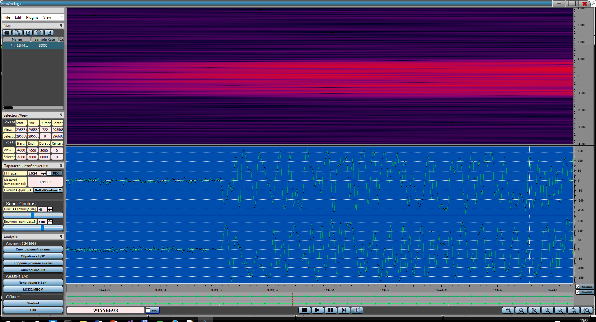

## Работа с огибающей сигнала

Огибающая для стереосигналов представлена в виде двух дорожек, для
моносигналов в виде одной дорожки:

{width="17.449677384076992in"
height="9.431026902887139in"}

Светло-зеленым отображается огибающая сигнала, темно зеленым RMS,
отображение которого можно отключить соответствующим чекбоксом:

{width="18.729932195975504in"
height="10.122965879265092in"}

При более детальном приближении осциллограмма автоматически переходит в
процесс отображения индивидуальных отсчетов.

{width="18.436165791776027in"
height="9.964194006999126in"}

Под осциллограммой присутствует шкала времени (красная стрелка), данная
шкала кликабельна и можно производить drag&Drop для перемещения по
временной шкале. Также можно изменить диапазон отображения по оси Y для
осциллограммы (желтая стрелка), данный диапазон автоматический, при
желании можно отключить автомасштабирование убрав розовую галочку. Для
удобства присутствует масштабирование по временной шкале кнопками
(зеленая рамка).

{width="19.947916666666668in"
height="10.779166666666667in"}
