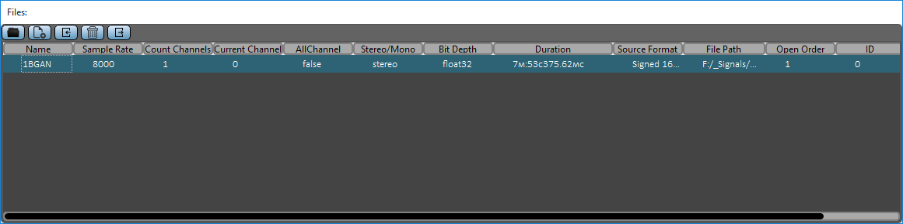

## **Изменение параметров**

{width="12.09375in"
height="3.0208333333333335in"}

У открытой реализации можно изменить некоторые параметры или
интерпретировать их другими значениями.

При двойном клике на имя или путь к файлу -- информация копируется в
буфер обмена.

При двойном клике на частоту дискретизации выпадает список:

-   Конвертировать частоту дискретизации (передискретизация)

-   Интерпретировать частоту дискретизации (изменить частоту
    дискретизации в проекте без передискретизации, интерпретировать
    иначе)

При двойном клике на количество каналов, текущем канале, отображать все
каналы или нет -- происходит интерпретация входной реализации с другими
параметрами (происходит реимпорт).

При двойном клике на стерео/моно:

-   Интерпретировать входную реализацию как моно/стерео

-   Конвертация в моно/стерео сигнал (модуляция/ преобразование
    Хильберта)

При двойном клике на формат источника:

-   Интерпретация входной реализации как другой тип данных

-   Конвертирование реализации в другой формат
