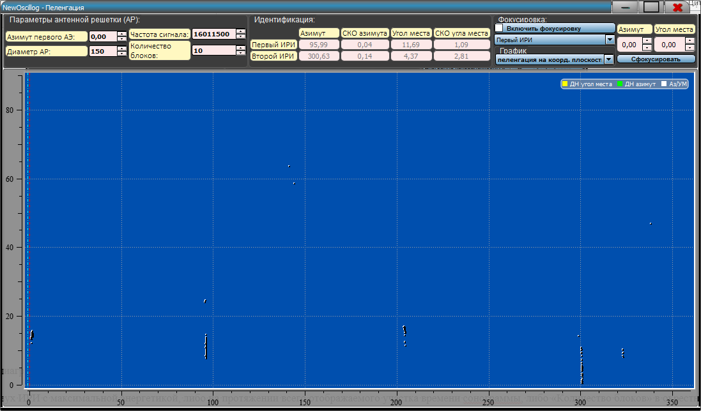
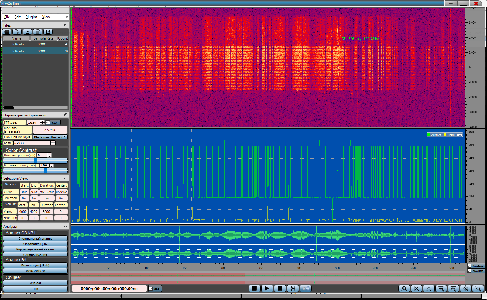
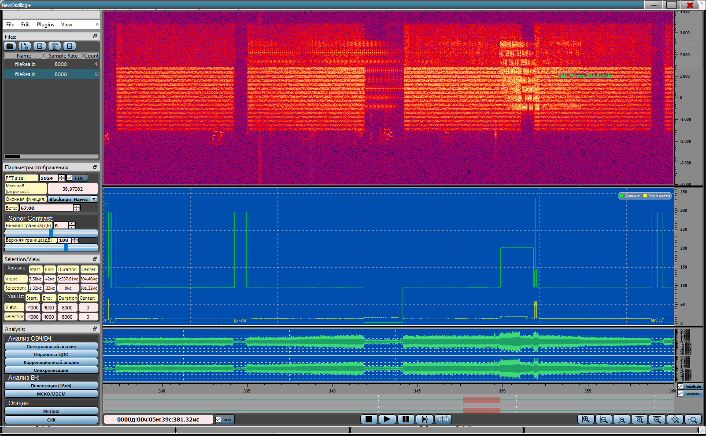
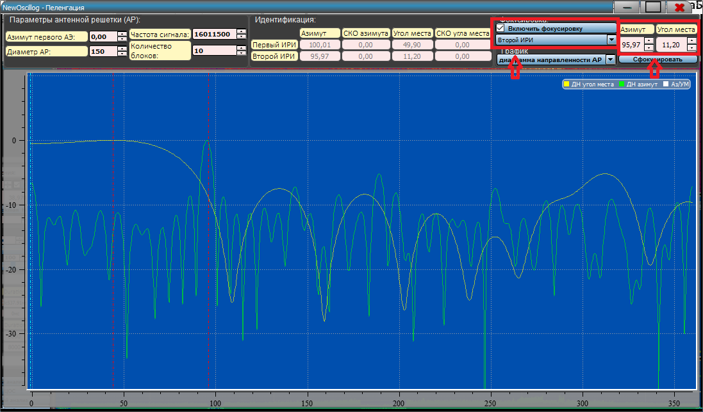
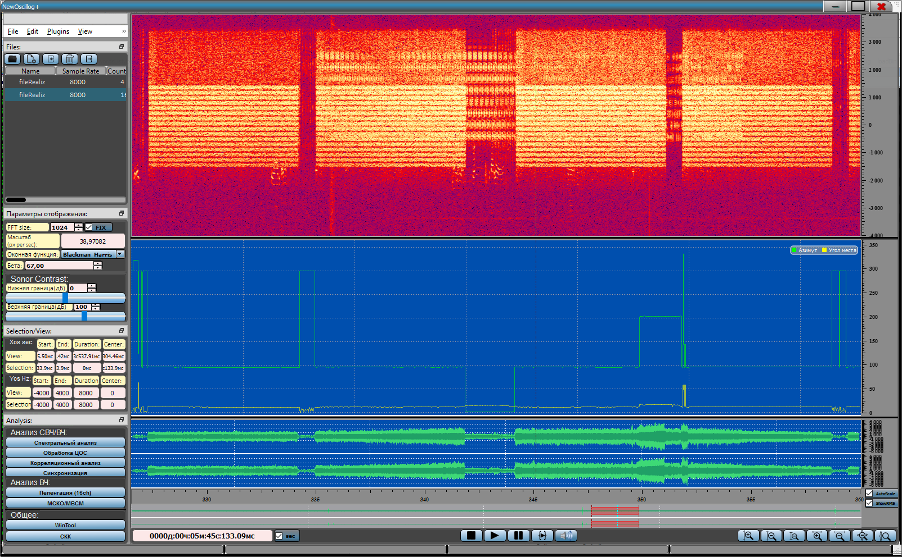
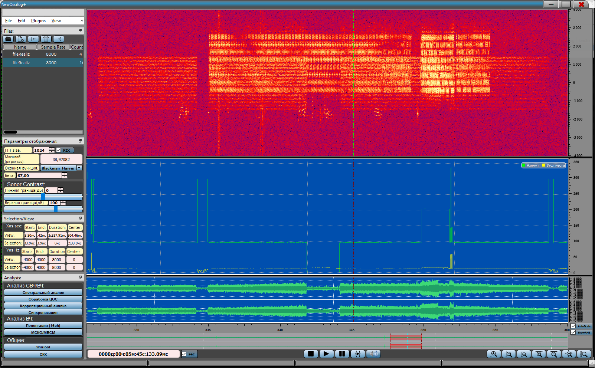
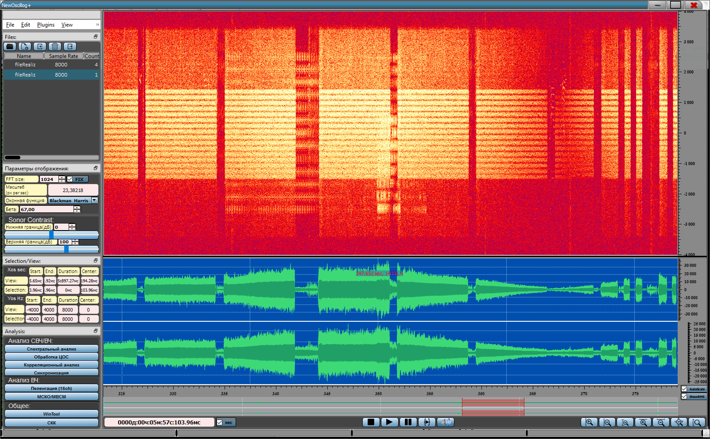

**Антенная решетка . Пеленгация**

 

Радиопеленгацией (радиопеленгованием) называется процесс определения
направления (пеленга) от наблюдателя на источник излучений радиоволн при
помощи радиопеленгатора --- приемника с антенной направленного действия.

Одним из современных комплексов приема различных сигналов ВЧ диапазона,
осуществляющего мониторинг, определение местоположения, распознавание,
взвешивание, и дальнейшую обработку сигналов, заменяющий целый
радиопост, является - Антенная решетка .

Антенная решетка  использует 17 элементную прореженную антенную решетку с диаметром
150 метров. Благодаря этому Антенная решетка  решает задачи как разнесенного
приема, так и пеленгации. Местоопределение источников излучения очень
важно в современном мире. Для пеленгационного анализа используется самый простой и
достаточно точный пеленгатор - амплитудный.

В ВЧ диапазоне существует целый ряд различных комплексов. В зависимости
от используемых АЦП, комплексы работают с различными типами данных.
Наиболее часто используются «unsigned short» или 16 разрядный
целочисленный действительный беззнаковый (диапазон от 0 до 65535) тип и
«complex float» 32 разрядный комплексный с плавающей точкой знаковый.
Также комплексы бывают одноканальные и многокальные.  Антенная решетка  записывает
многоканальные реализации формата «complex float».

 

В комплексе  Антенная решетка  используется 17-ти элементная прореженная кольцевая
антенная решетка -АФС.  Антенная решетка  записывает 16-ти канальные реализации,
благодаря тому, что антенная решетка прорежена для всего ВЧ диапазона
возможно осуществить радиопеленгование источника радиоизлучения.

В ПО «NewOscillog» используется амплитудное пеленгование. **Амплитудные
методы** пеленгации основаны на использовании направленных свойств
антенн. Исторически самым первым был амплитудный способ радиопеленгации.
Амплитудный способ, как следует из самого названия, основан на анализе
амплитудного распределения поля, создаваемого пеленгуемым сигналом, на
раскрыве приемной антенны: уровень сигнала максимален в том случае,
когда раскрыв антенны параллелен фронту падающей волны. Известны три
разновидности амплитудного способа: пеленгование по максимуму, по
минимуму и пеленгование на основе сравнения.

Направление на ИРИ в ПО определяется путем сравнения угла между двумя
векторами -- первым собственным (либо корреляционным вектором),
содержащим фазовые задержки антенных элементов, создаваемые ИРИ, и
табличными векторами фазовых задержек для различных углов прихода волны.
Попросту говоря, при пеленговании антенну с известной диаграммой
направленности искусственно (весовыми коэффициентами) поворачивают в
пространстве до получения максимального значения мощности на выходе
антенной решетки, которое регистрируется индикатором.

Данный метод относится к поисковым способам пеленгации, он позволяют
определять направление на источник путем последовательного просмотра
разведываемого пространства. Определение пеленга источника излучения в
этом случае требует некоторого времени.

Для того, чтобы включить отображение модуля пеленгации, необходимо
нажать на кнопку «Пеленгация» либо на клавиатуре «**CTRL+5**», данный
вид анализа применим только для 16-ти канальных реализаций:

{width="11.427083333333334in"
height="6.708333333333333in"}

Данный модуль по умолчанию отображает диаграмму направленности антенной
решетки согласно «Параметрам антенной решетки».

**Идентификация** отображает координаты двух ИРИ с максимальной
энергетикой, либо на протяжении всего отображаемого участка времени
сонограммы, либо «Количество блоков» в окрестности марке на сонограмме.
Пеленгация осуществляется по первому собственному вектору выборочной
корреляционной матрицы, рассчитанному в позиции маркера с эталоном или
на временном отображении сонограммы. Вся информация о угловых
координатах ИРИ выводится на форму.

В модуле Пеленгация имеется возможность выбрать один из двух типа
графика:

-   Диаграмма направленности антенной решетки

-   Пеленгация на координатной плоскости (ось X -- азимут, ось Y -- угол
    места)

{width="11.427083333333334in"
height="6.708333333333333in"}

Пеленгация на координатной плоскости

В данном режиме участок времени отображенный на сонограмме анализируется
и отображаются точки на плоскости азимут/угол места (ось X -- азимут,
ось Y -- угол места).

При активации модуля Пеленгация на главной форме вместо графика Вектора
собственных значений отображается график азимута и угла места от
времени:

{width="16.697916666666668in"
height="10.333333333333334in"}

{width="16.697916666666668in"
height="10.333333333333334in"}

Модуль пеленгации позволяет в реальном времени сфокусировать ДН АР в
заданном направлении, для этого необходимо активировать «Включить
фокусировку». Для удобства присутствует выпадающий список из двух ИРИ
для задания ДН антенной решетки в направлении ИРИ.

{width="11.428472222222222in"
height="6.701388888888889in"}

ДН антенной решетки сфокусирована в направлении второго ИРИ

При включении «Включить фокусировку» - сонограмма также фокусируется в
реально времени в направлении заданных координат.

{width="16.697916666666668in"
height="10.333333333333334in"}

Управляя параметрами антенной решетки и Азимутом/Углом места можно
добиться пространственным разрешением помехи и полезного сигнала.

{width="16.697916666666668in"
height="10.333333333333334in"}

{width="16.697916666666668in"
height="10.333333333333334in"}

При нажатии кнопки «Сфокусировать» произойдет взвешивание многоканальной
реализации по критерию АРФ и преобразование в одноканальную взвешенную
реализацию.

{width="16.697916666666668in"
height="10.333333333333334in"}

Взвешенная одноканальная реализация в направлении источника с полезной
нагрузкой. В данном месте накладываются две помехи на полезный сигнал.
