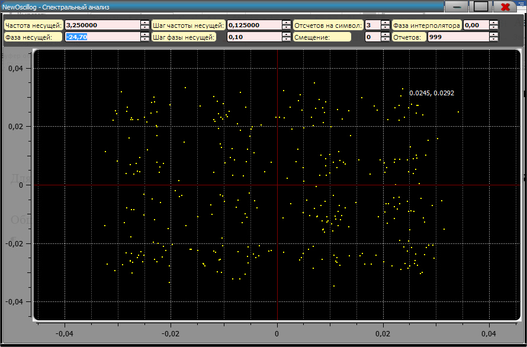

**Фазовая плоскость**

Для вызова модуля Фазовой плоскости необходимо нажать на «**СКК**» или
на клавиатуре «**CTRL+7**».

Общий вид Модуля СКК:

{width="9.270833333333334in"
height="6.104166666666667in"}

На данном скриншоте рассмотрен пример реализации КАМ-16.

Данный модуль позиционируется на начало выделенного участка или на
маркер, необходимо задать количество отсчетов на символ, также задается
частота несущей и фаза несущей.

Пример ФМ-8:

{width="9.270833333333334in"
height="6.104166666666667in"}
