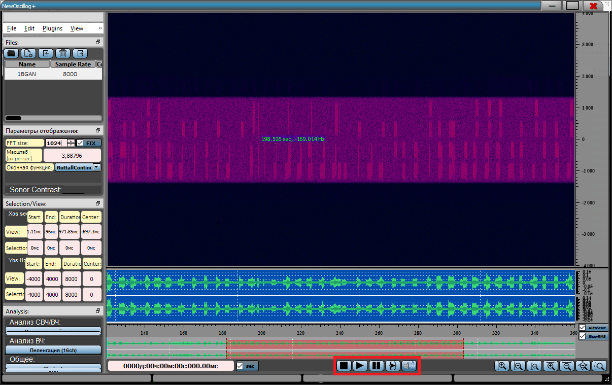

**Воспроизведение**

{width="12.5625in"
height="7.90625in"}

ПО поддерживает воспроизведение реализаций с заданной частотой
дискретизации, которая ограничена звуковой картой ПК. Если данная
частота дискретизации не поддерживается, используется наиболее близкая
частота дискретизации из возможных. Для удобства имеется набор кнопок --
Стоп, Воспроизведение, Пауза, Проиграть выделенный участок,
Выключить/Включить звук.
