**Редактор**

Для ознакомление возможностей редактирования рассмотрим спутниковую
реализацию BGAN:

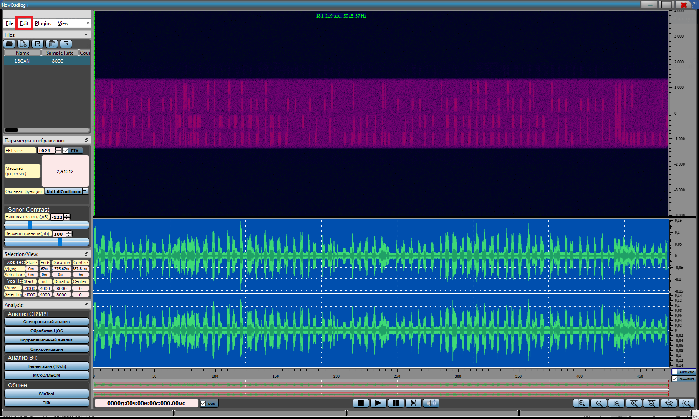{width="17.447916666666668in"
height="10.46875in"}

При зажатом колесе мыши имеется возможность выделить произвольный
прямоугольник:

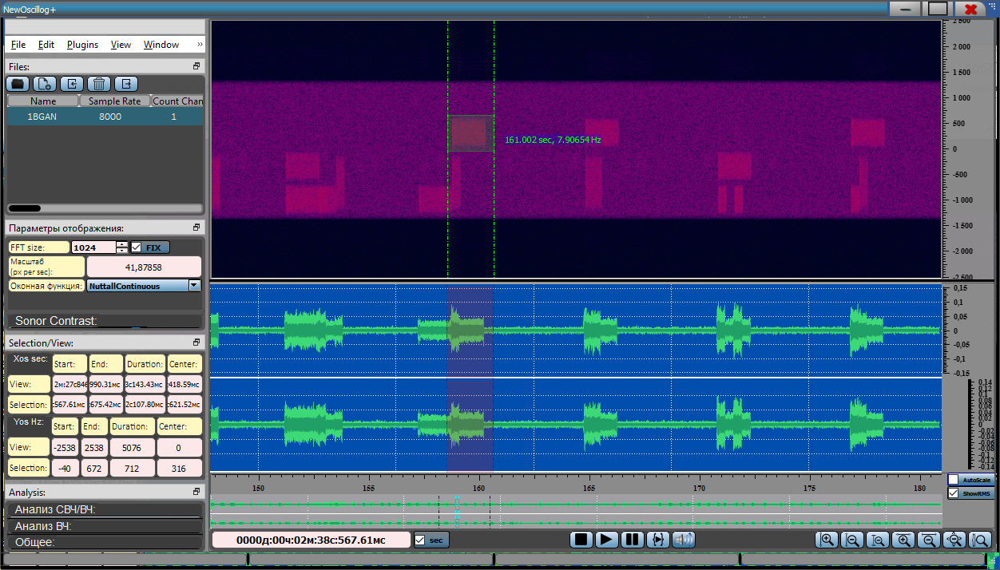{width="13.041666666666666in"
height="7.4375in"}

Любое выделение можно:

-   Вырезать и поместить в буфер участок от до

-   Скопировать в буфер участок от до

-   Скопировать в новую реализацию

-   Вставить фрагмент из буфера

-   Удалить выделенный фрагмент

-   Заполнить тишиной

-   Заполнить тишиной все кроме выделенного периода (Trim)

В разделе Edit:

-   Freq Shift Select -- сдвинуть по частоте выделенный участок

-   Filter Select -- фильтрация выделенной области, появляется окно, в
    котором заданы выделенные параметры (Верхняя/Нижняя частота среза)

> 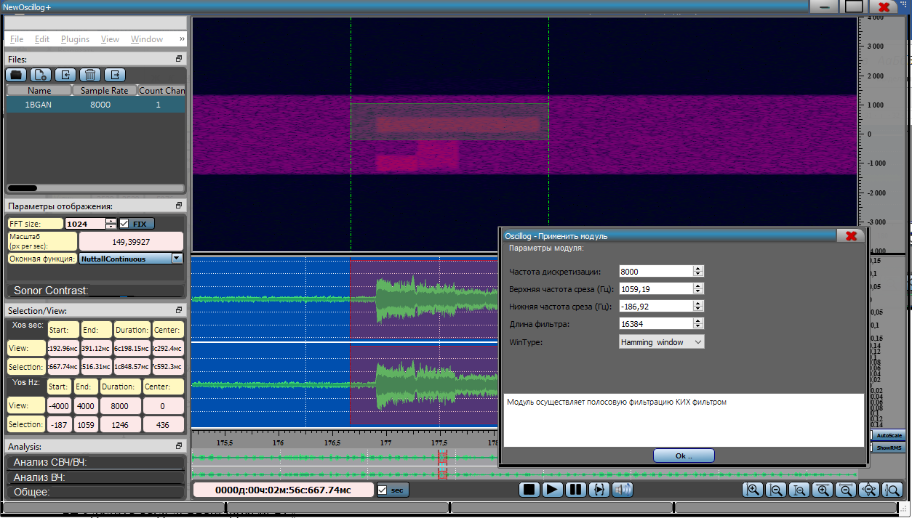{width="13.0625in"
> height="7.427083333333333in"}
>
> Результат:

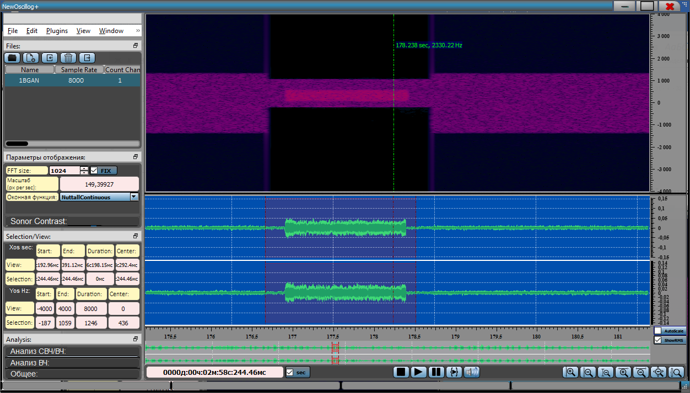{width="13.041666666666666in"
height="7.4375in"}

-   Cut Freq Select -- вырезание выделенного участка:

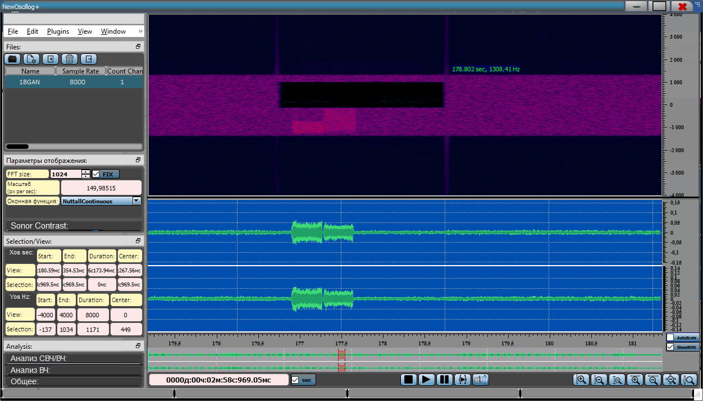{width="13.041666666666666in"
height="7.4375in"}

-   Filter Translate Resample (FTR) -- фильтрация, перенос по частоте,
    передискретизация с заданными параметрами (параметры задаются
    автоматически, можно редактировать)

> 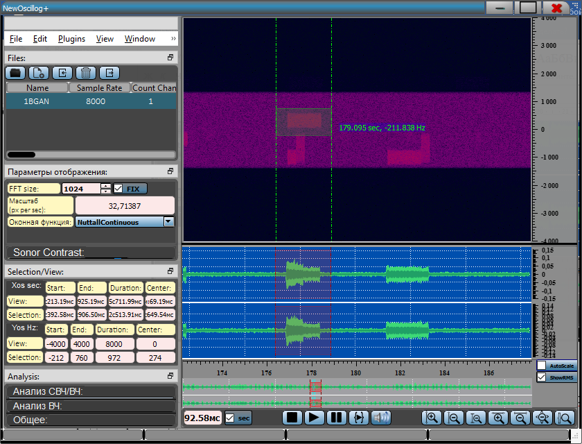{width="8.75in"
> height="6.666666666666667in"}
> 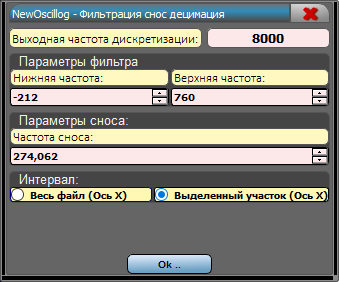{width="3.53125in"
> height="2.9375in"}
>
> Результат:
>
> 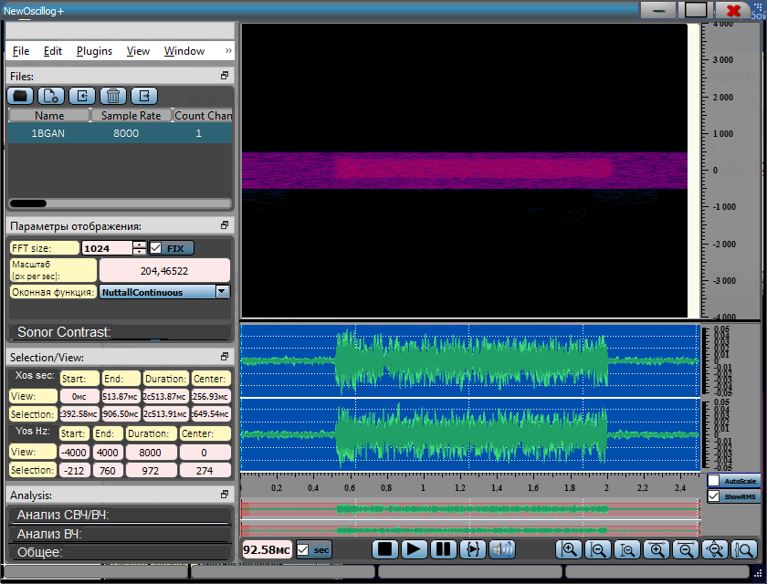{width="8.75in"
> height="6.666666666666667in"}

Также к реализации можно применить любой из модулей ЦОС из раздела
Plugins, например, применить нелинейное преобразование, возведем во
вторую степень, чтобы точно определить несущую частоту:

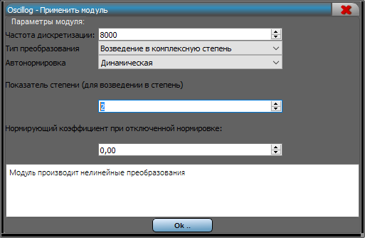{width="5.34375in"
height="3.4791666666666665in"}

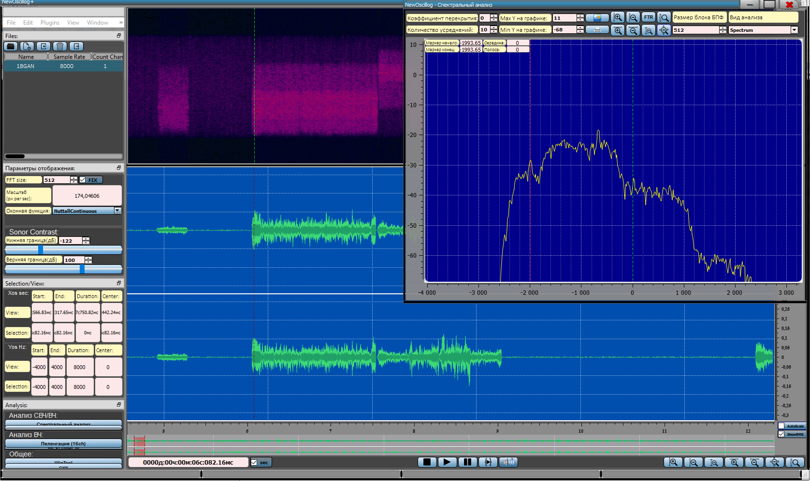{width="17.458333333333332in"
height="10.385416666666666in"}

Нашли два пика (при возведении в степень 2 выделяется несущая частота)
один на частоте 665,3/2 = 332,6, второй 1993/2 = 996,5, что
соответствует действительности:

{width="7.509612860892388in"
height="5.668140857392826in"}
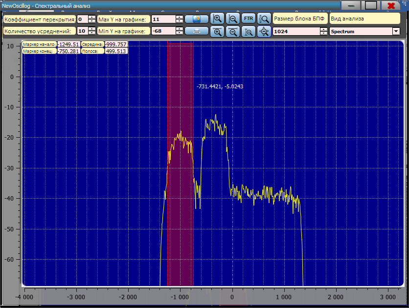{width="7.489583333333333in"
height="5.645833333333333in"}
