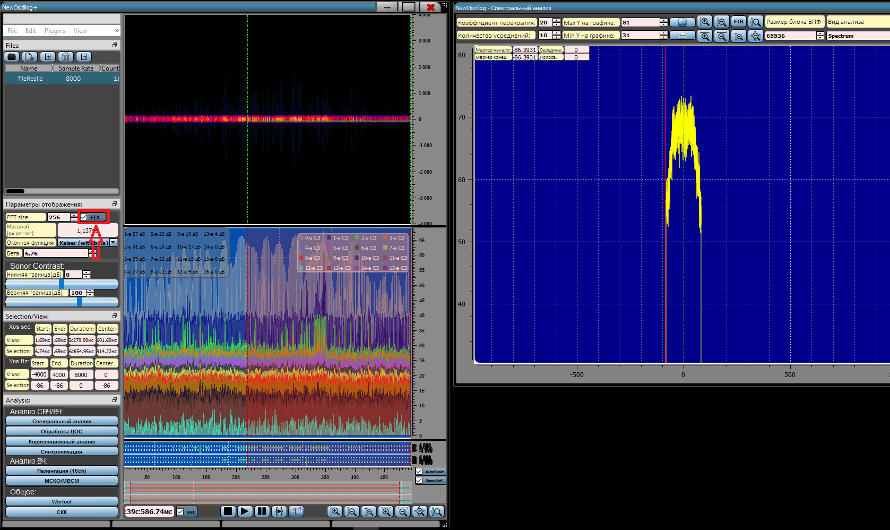

## Спектральный анализ

ПО позволяет получить сонограмму (водопад) входного файла.
Спектрограмма (Спектр во временной позиции) в окрестности позиции
маркера на сонограмме. Спектр с усреднением выделенной области.
Благодаря спектральному анализу можно оценить такие параметры сигнала,
как: центральная частота, полоса сигнала, вид модуляции, наличие помех,
качество сигнала и многое другое.

В результате спектрального анализа специалист может многое узнать о
сигнале: определить вид модуляции, ширину полосы сигнала, мощность
сигнала, наличие помех, символьную скорость, иногда даже «демодулировать
на глаз» и многое другое. Однако для этого требуется использование ПО со
специфическими возможностями. Также, используя различные весовые
функции, специалист может управлять такими эффектами как уровень боковых
лепестков и ширина главного лепестка, что в конечном счете может
повлиять на обнаружение сигнала маленькой амплитуды, спектр которого
находится под боковым лепестком другого сигнала, или различить частотные
компоненты сигнала. Также при применении различных оконных функций может
наблюдаться эффект *просачивания спектральных составляющих,* вследствие
которого могут появиться ложные или скрыться истинные максимумы спектра.

Чтобы минимизировать просачивание спектральных составляющих, форма
весовой функции выбирается с минимальными уровнями боковых лепестков. К
сожалению, это приводит к увеличению ширины основного лепестка, так что
он расширяется на соседние боковые лепестки (происходит наложение).
Данный эффект имеет место для всех гармоник, а общий результат --
наложение спектра сигнала, или размывание. Таким образом, весовые
функции и их параметры надлежит выбирать тщательно, чтобы добиться
оптимального баланса между разрешением по частоте и статической
точностью оценки спектра.

Для того, чтобы включить отображение спектра, необходимо нажать на
кнопку «Спектральный анализ» либо на клавиатуре «**CTRL+S**» или
«**CTRL+1**»:

{width="15.766234689413823in"
height="9.461875546806649in"}

Форма «Спектральный анализ» позволяет осуществлять 5 основных видов
анализа: **Spectrum**(классический спектр), **Autocorrelation**,
**CubeRootAutocorrelation**, **EnchancedAutocorrelation**, **Cepstrum**.

{width="14.781995844269467in"
height="9.173451443569554in"}

Полученная спектрограмма масштабируется, размер окна можно изменять,
имеется возможность печати картинки, либо сохранения ее в такие форматы
как \*.pdf \*.bmp \*.jpeg \*.jpg \*.png и т. д.

> В программе имеется возможность изменять размер блока БПФ или ДПФ в
> диапазоне от **32** до **16384** точек для сонограммы и от **16** до
> **65536** для спектра, причем размер блока не обязательно должен быть
> степени двойки, что позволяет добиться компромисса между частотным и
> временным разрешением. Имеется возможность задать количество блоков
> для усреднения, а также коэффициент перекрытия между блоками,
> использовать различные оконные функции. Для задания Размера блока
> БПФ/ДПФ необходимо изменить значение в поле «Размер блока БПФ» или
> «FFT size»:

Также при клике, либо колесом мыши на оси X и Y графика спектрограммы
изменяет диапазон оси. Количество усреднений и коэффициент перекрытия
между блоками можно задать вручную. График спектрограммы кликабельный,
также, как и оси графика, информация о выделенной области или позиции
маркера выводится на вспомогательную форму:

> {width="9.819278215223097in"
> height="7.147566710411199in"}
>
> Функция **FTR --** позволяет выфильтровать, снести по частоте и
> изменить частоту дискретизации выделенной области на спектре
> (параметры задаются выделением, но могут редактироваться в
> соответствующей форме). Продолжительность вырезания: весь файл, либо
> участок по оси X, выделенный на сонограмме.
>
> {width="12.571428258967629in"
> height="6.856916010498687in"}

Результат **FTR**

{width="15.7425in"
height="9.363636264216973in"}

«**FIX**» означает, что размер сонограммы фиксирован и размер блока
БПФ/ДПФ никак не влияет на её размер. Если FIX выключен сонограмма
отображается «пиксель в пиксель» - размер по высоте равен размеру блока
БПФ/ДПФ (ограничено разрешением монитора).

На следующем рисунке представлена реализация с частотой дискретизации
251,4219МГц, полностью оцифрована полезная нагрузка спутника. СПО
позволяет анализировать необходимые участки сонограммы и спректрограммы.
Выделение области на сонограмме -- выделяет соответствующую область на
спектрограмме и наоборот.

{width="16.419772528433946in"
height="9.787203630796151in"}

На данном рисунке представлен пример спектрального анализа Clover.
Анализируя сонограмму сигнала Clover с прямоугольным окном и размером
блока ДПФ равным 120 однозначно сказать ничего нельзя, однако, установив
окно Гаусса, можно сделать вывод, что информация в данном сигнале
передается небольшими посылками, сдвинутыми по частоте и времени, что
очень хорошо видно на сонограмме сигнала.

{width="8.021606517935258in"
height="9.449982502187227in"}
{width="7.863380358705162in"
height="9.263581583552057in"}

> В данном ПО имеется широкий выбор [оконных
> функций](file:///G:\_Projects\_Projects\NewOscillog\NewOscillog\Docs\docx\Wintool.docx)

-   HAMMING - Hamming window max attenuation 53 dB

-   HANN - Hann window max attenuation 44 dB

-   BLACKMAN - Blackman window max attenuation 74 dB

-   RECTANGULAR - Basic rectangular window max attenuation 21 dB

-   KAISER - Kaiser window max attenuation see window::max_attenuation

-   BLACKMAN - HARRIS - Blackman-harris window max attenuation 92 dB

-   BARTLETT - Barlett (triangular) window max attenuation 26 dB

-   FLATTOP - flat top window useful in FFTs max attenuation 93 dB

-   HANNING - Hanning window

-   BLACKMAN2 - Blackman window

-   BLACKMAN3 Blackman window

-   BLACKMAN4 - Blackman window

-   NUTTALL - Nuttall window

-   NuttallContinuous - Nuttall continuous first derivative window

-   WELCH - WELCH window

-   PARZEN - PARZEN window

-   Exponential - exponential window

-   Riemann - exponential window

-   Bartlett_Hann - Bartlett_Hann window

-   Gaussiana1 - Gaussiana1 window

-   Blackman_Nuttall - Blackman_Nuttall window

-   cosine - cosine window

-   Tukey - Tukey window

-   Planck_taper - Planck_taper window

-   Exponential_or_Poisson_D - Exponential_or_Poisson_D window

-   Sinc - Sinc window

-   SquareRootTriangle - The square-root of the Triangle window.

-   DolphChebyshevWindow - Dolph-Chebyshev window

> Для выбора вида оконной функции необходимо нажать на «**Оконная
> функция**»:
>
> {width="12.382147856517935in"
> height="9.714285870516186in"}

**Спектральный анализ реализации Pactor**

{width="12.743725940507437in"
height="10.000772090988626in"}

Реализация Pactor (размер БПФ 1024, оконная функция «Kaiser»)

Данный сигнал представляет собой частотную манипуляцию, что легко
заметить, установив блок БПФ 128 и выбрав оконную функцию
«Blackman-Harris.

{width="14.693057742782152in"
height="8.773804680664917in"}

Реализация Pactor (размер БПФ 128, оконная функция «Blackman-Harris»)

На сонограмме видна частотная манипуляция, а на спектрограмме ярко
выражена гармоника. Данный сигнал возможно «демодулировать на глаз»
благодаря правильному подбору оконной функции и размера блока ДПФ.

Если использовать другую оконную функцию, например, sinc, во-первых,
нельзя однозначно определить относится ли модуляция данного сигнала к
частотной манипуляции, а во-вторых, невозможно «продемодулировать на
глаз.

{width="15.206753062117235in"
height="9.017115048118985in"}

Реализация Pactor (размер БПФ 128, оконная функция sinc)

По сонограмме, также, как и по спектрограмме, уже трудно сказать, что
данный сигнал представляет из себя частотную манипуляцию.

**Анализ сигналов**

 

**Анализ** -- один из ключевых компонентов обработки сигналов. Основной
целью анализа является сравнение сигналов друг с другом для выявления их
сходства и различия.

**Анализ сигналов** --- извлечение информации из
[[сигнала]{.underline}](https://ru.wikipedia.org/wiki/%D0%A1%D0%B8%D0%B3%D0%BD%D0%B0%D0%BB),
например, выявление и обособление интересующих особенностей в
экспериментально полученной функции.

Можно выделить три основных составляющих анализа сигналов:

> •       Измерение числовых параметров сигналов. К таким параметрам
> прежде всего относятся энергия, средняя мощность и
> среднеквадратическое значение.
>
> •       Разложение сигнала на элементарные составляющие для их
> рассмотрения по отдельности либо для сравнения свойств различных
> сигналов. Такое разложение производится с использованием рядов и
> интегральных преобразований, важнейшим среди которых является ряд
> Фурье и преобразование Фурье.
>
> •       Количественное измерение степени «похожести» различных
> сигналов. Такое измерение производится с применением аппарата
> корреляционного анализа.

 

**Спектральный анализ радиосигналов**

 

Спектральное преобразование представляет собой перевод исходных
динамических функций на новый координатный базис. Выбор рациональной
ортогональной системы координатного базиса функций зависит от цели
исследований и определяется стремлением максимального упрощения
математического аппарата анализа, преобразований и обработки данных. В
качестве базисных функций используются полиномы Чебышева, Эрмита,
Лежандра и другие. Наибольшее распространение получило преобразование
сигналов в базисах гармонических функций: комплексных экспоненциальных
exp(2jωt) и вещественных тригонометрических синус-косинусных функций,
связанных друг с другом формулой Эйлера. Это объясняется тем, что
гармонические колебания сохраняют свою форму при прохождении через любую
линейную цепь, изменяются только амплитуда и фаза колебаний, что удобно
для анализа систем преобразования сигналов. Спектральный анализ часто
называют частотным анализом.

Спектральный анализ наиболее часто применяется в радиотехники. Благодаря
ему решается ряд задач оптимального приема, такие как: обнаружение
сигнала, оценка мощности, определение наличия помех и т.д.

Один из важных вопросов, который является общим для всех классических
методов спектрального оценивания, связан с применением функций окна.

Заметим, что конечную запись данных x(n) из N отсчетов можно
представить, как некоторую часть исходной бесконечной последовательности
x(n), видимую через прямоугольное окно w(n), в форме произведения:

x\[n\] = x\[n\]•w\[n\], при этом мы полагаем, что все ненаблюдаемые
отсчеты равны нулю независимо от того, так ли это на самом деле или нет.

ДВПФ взвешенной окном последовательности, выраженное через
преобразования последовательности x\[n\] и прямоугольного окна w\[n\],
равно свертке этих преобразований (1.1).

{width="3.0256944444444445in"
height="0.5583333333333333in"} (1.1)

Где
{width="3.2729166666666667in"
height="0.7923611111111111in"} - ядро Дирихле, представляющее ДВПФ
прямоугольной функции. ДВПФ наблюдаемой конечной последовательности
является искаженной версией ДВПФ бесконечной последовательности.

Влияние прямоугольного окна на дискретно-временную синусоиду с частотой
f0 иллюстрирует (см. Рисунок 1.5), из которого видно, что острые
спектральные пики ДВПФ исходной синусоидальной последовательности
расширились из-за воздействия ДВПФ окна. При этом минимальная ширина
спектральных пиков конечной последовательности ограничена шириной,
определяемой главным лепестком ДВПФ окна, и не зависит от исходных
данных. Боковые лепестки ДВПФ окна, называемые растеканием
\[просачиванием (spectral leakage)\] будут изменять амплитуды соседних
спектральных пиков, приводя к смещению спектральных оценок. Аналогичные
искажения будут наблюдаться и в случае несинусоидальных сигналов.
Просачивание приводит не только к появлению амплитудных ошибок, но может
также маскировать присутствие слабых сигналов и, следовательно,
затруднять их обнаружение.

{width="5.116666666666666in"
height="2.765972222222222in"}

Рисунок 1.5 -- Иллюстрация эффекта растекания спектра из-за взвешивания
данных: а -- исходная последовательность; б -- модуль периодического
ДВПФ синусоидальной последовательности; в -- взвешенная синусоидальная
последовательность; г -- модуль ДВПФ взвешенной синусоидальной
последовательности

 

В спектральном анализе наиболее часто применяется метод периодограмм,
оценка спектра по некоторому отрезку сигнала. Предложен ряд модификаций
соотношения суть которых сводится к сглаживанию оценки путем введения
псевдоусреднения по некоторому ансамблю. Наибольшую популярность в
настоящее время получил метод Уэлча, идея которого состоит в образовании
псевдоансамбля периодограмм за счет разбиения наблюдаемых данных на
перекрывающиеся сегменты и обработки каждого сегмента с помощью окна
данных.

Метод периодограмм (перекрытие блоков, усреднение и наложение различных
окон) реализовано только в специфическом программном обеспечении.
Гибкого изменения параметров современные ПО не представляют.

 
