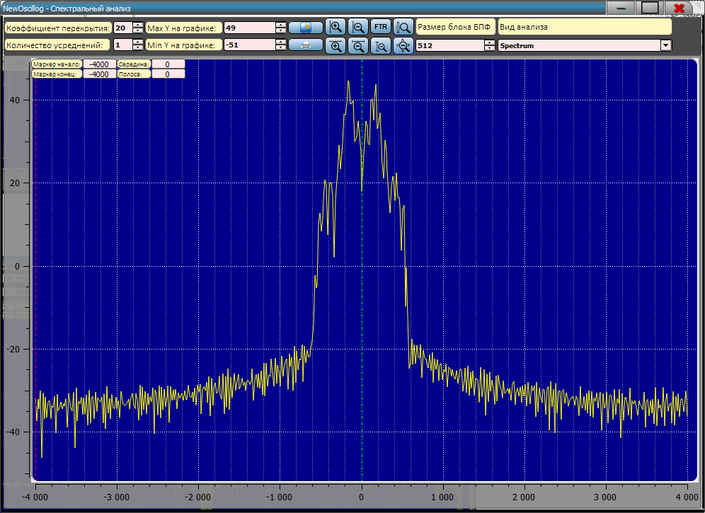
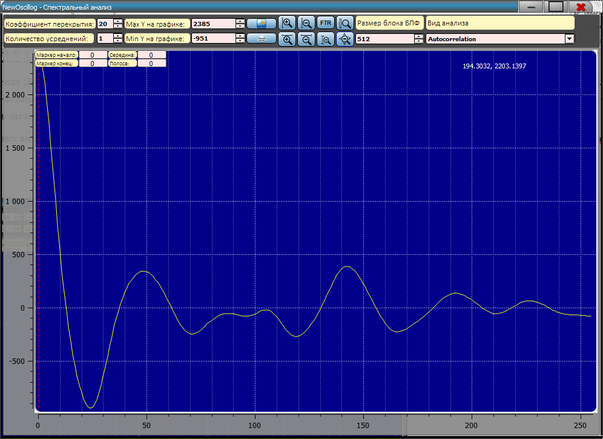
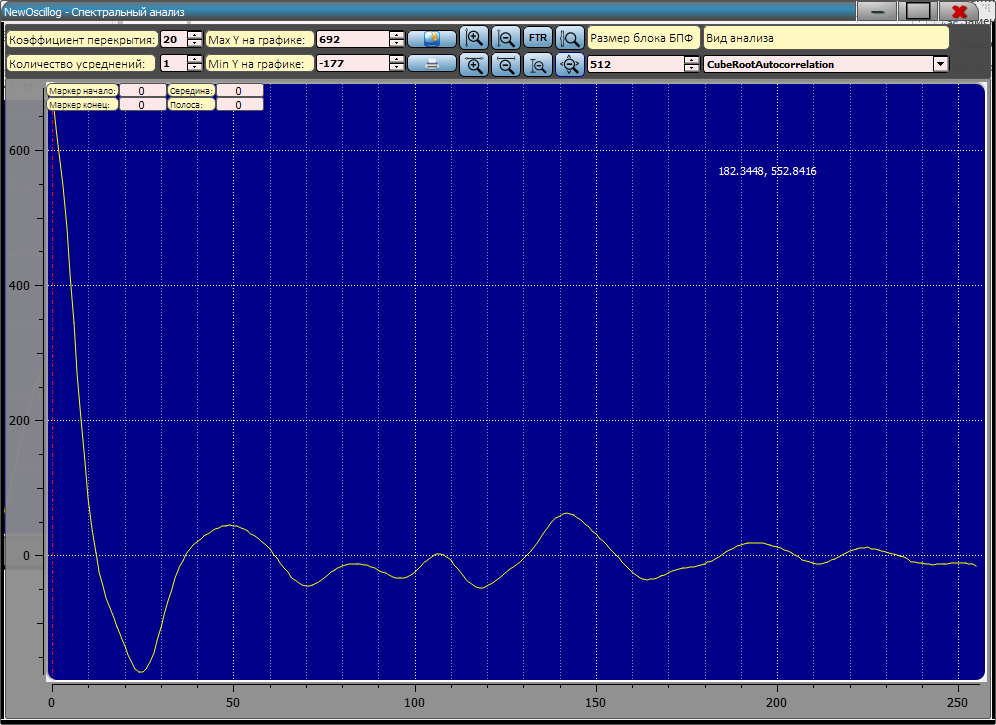
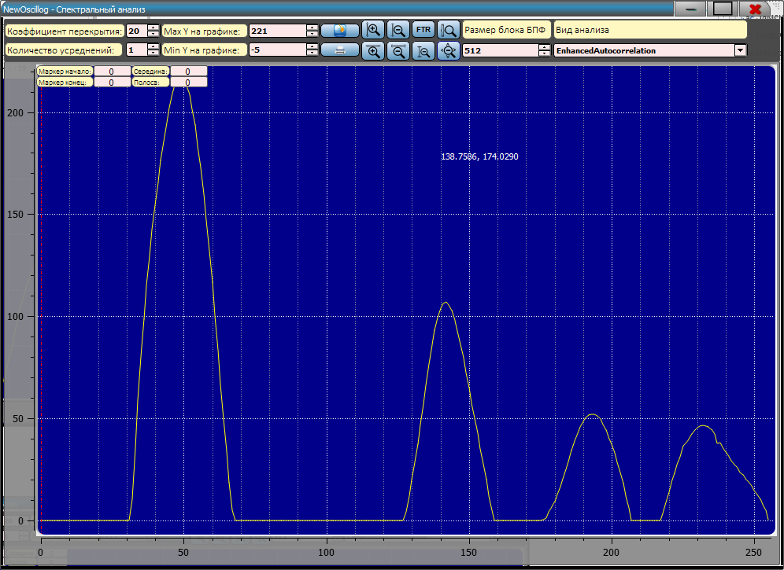
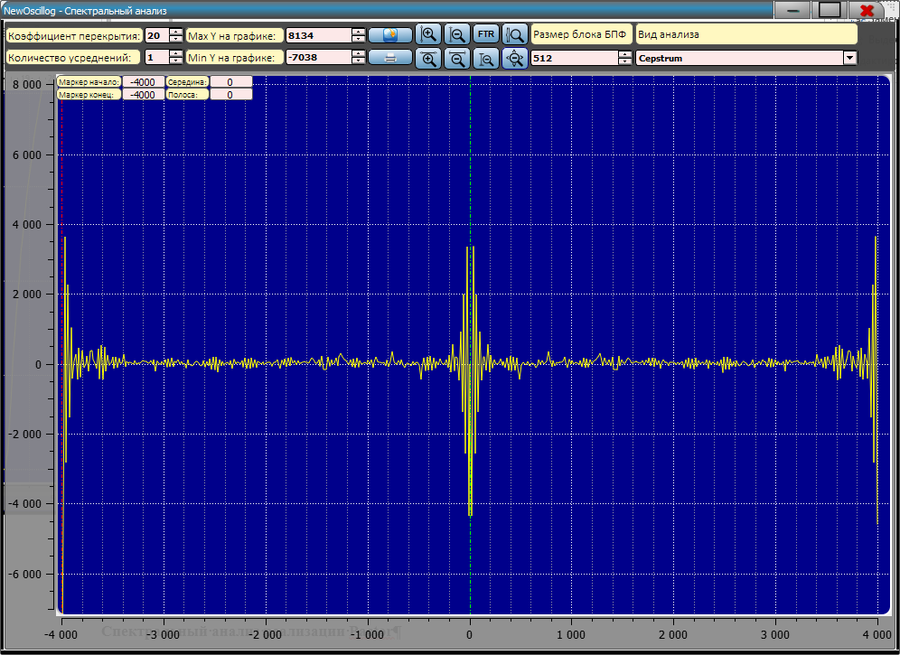
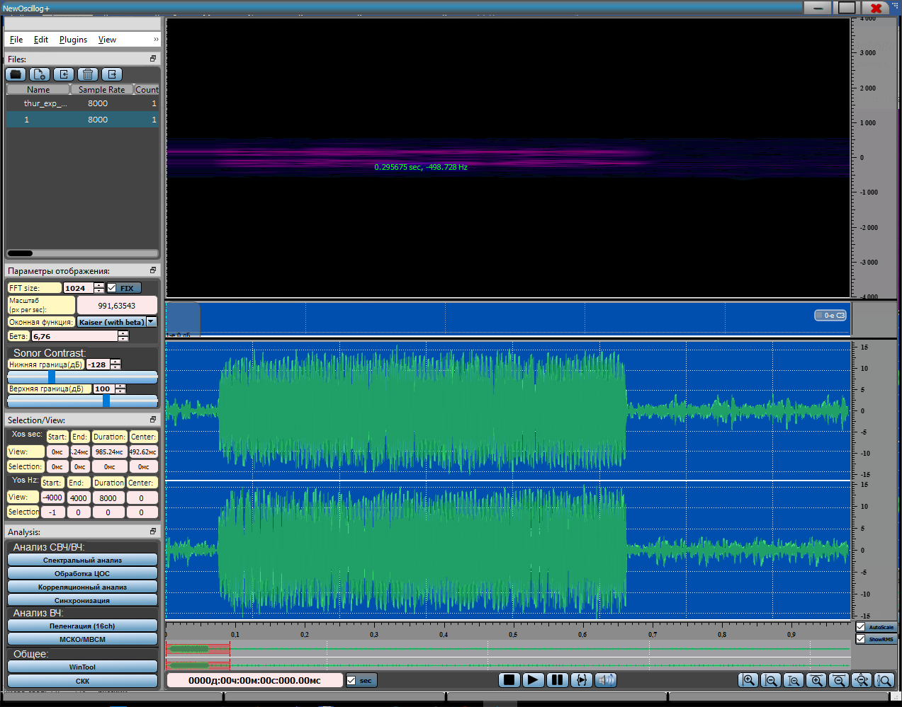
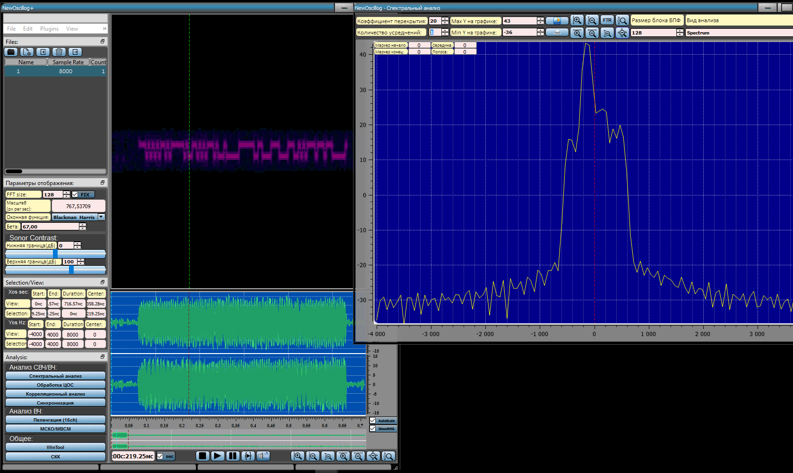
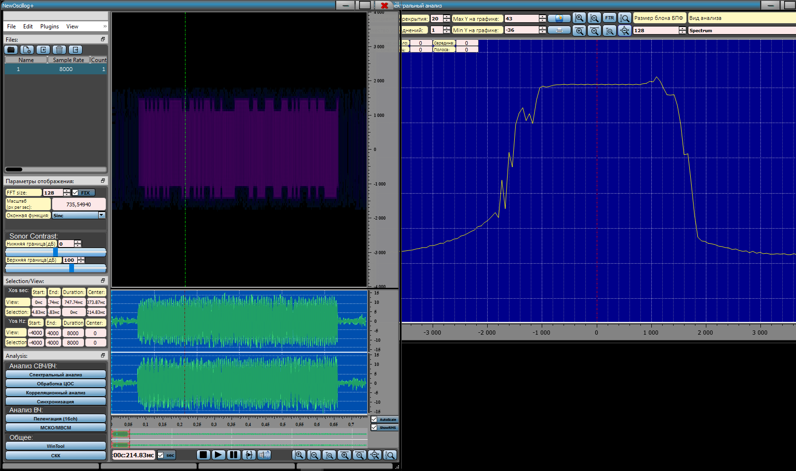

## Спектральный анализ

> Для того, чтобы включить отображение спектра, необходимо нажать на
> кнопку «Спектральный анализ» либо на клавиатуре «**CTRL+S**» или
> «**CTRL+1**»:
>
> В программе имеется возможность изменять размер блока БПФ или ДПФ в
> диапазоне от **16** до **65536** для спектра, причем размер блока не
> обязательно должен быть степени двойки, что позволяет добиться
> компромисса между частотным и временным разрешением. Имеется
> возможность задать количество блоков для усреднения, а также
> коэффициент перекрытия между блоками, использовать различные оконные
> функции. Для задания Размера блока БПФ/ДПФ необходимо изменить
> значение в поле «Размер блока БПФ» или «FFT size»:
>
> Форма «Спектральный анализ» позволяет осуществлять 5 основных видов
> анализа: **Spectrum**(классический спектр), **Autocorrelation**,
> **CubeRootAutocorrelation**, **EnchancedAutocorrelation**,
> **Cepstrum**.

**Spectrum:**

{width="10.375in"
height="7.552083333333333in"}

**Autocorrelation:**

{width="10.375in"
height="7.552083333333333in"}

**CubeRootAutocorrelation:**

{width="10.375in"
height="7.552083333333333in"}

**EnchancedAutocorrelation:**

{width="10.375in"
height="7.552083333333333in"}

**Cepstrum:**

{width="10.375in"
height="7.552083333333333in"}

**Спектральный анализ реализации Pactor**

{width="13.260416666666666in"
height="10.40625in"}

Реализация Pactor (размер БПФ 1024, оконная функция «Kaiser»)

Данный сигнал представляет собой частотную манипуляцию, что легко
заметить, установив блок БПФ 128 и выбрав оконную функцию
«Blackman-Harris.

{width="17.479166666666668in"
height="10.4375in"}

Реализация Pactor (размер БПФ 128, оконная функция «Blackman-Harris»)

На сонограмме видна частотная манипуляция, а на спектрограмме ярко
выражена гармоника. Данный сигнал возможно «демодулировать на глаз»
благодаря правильному подбору оконной функции и размера блока ДПФ.

Если использовать другую оконную функцию, например, sinc, во-первых,
нельзя однозначно определить относится ли модуляция данного сигнала к
частотной манипуляции, а во-вторых, невозможно «продемодулировать на
глаз.

{width="17.479166666666668in"
height="10.364583333333334in"}

Реализация Pactor (размер БПФ 128, оконная функция sinc)

По сонограмме, также, как и по спектрограмме, уже трудно сказать, что
данный сигнал представляет из себя частотную манипуляцию.
