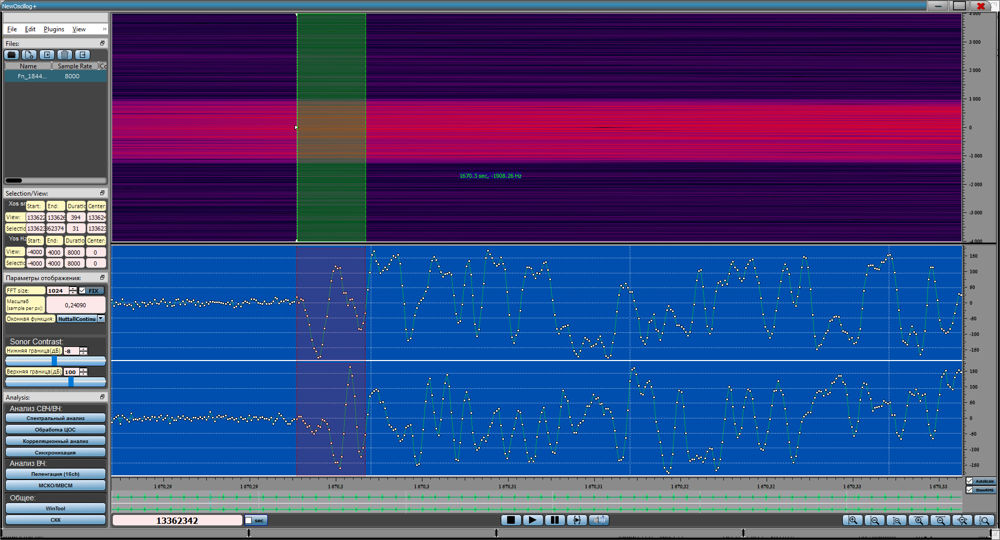

**Синхронизация с выбранным эталоном**

ПО NewOscillog имеет возможность произвести потоковый корреляционный
анализ реализации с выбранным списком эталонов, решить задачу
синхронизации по времени и частоте. В результате сохраняется файл для
демодуляторов, и все найденные эталоны отображаются соответствующим
цветом и частотой смещения относительно эталона на сонограмме и
осциллограмме.

Для того, чтобы включить отображение синхронизации, необходимо нажать на
кнопку «Синхронизация» либо на клавиатуре «**CTRL+P**» или «**CTRL+3**»:

{width="16.357661854768153in"
height="8.840824584426947in"}

Пример сработавших эталонах на реализации MilStd.

После исследования корреляционного отклика выбранный эталон можно
сохранить, после этого эталон автоматически добавится в список
пользовательских эталонов. Возможность вырезать эталон из сонограммы
позволяет на первоначальном этапе подобрать эталон к сигналам с
неизвестными синхровставками, протестировать его и в дальнейшем
поставить на прием данный вид сигналов в специализированных комплексах.
Добавить новый эталон можно в разделе [Корреляционного
анализа](Corr.docx).

После того как сформирован список эталонов, определены их параметры,
исследованы корреляционные свойства, имеется возможность провести
«потоковый» анализ файла -- определить наличие в файле сигналов заданных
видов передач, задав определенный набор эталонов (решить задачу
синхронизацию по времени и частоте). В процессе анализа информация о
найденных эталонах, их временных позициях, частотных параметрах
сохраняется в сопроводительный файл. Формат сопроводительных файлов
выбран таким, чтобы он мог использоваться демодуляторами, входящими в
состав одного из комплексов приема сигналов ВЧ диапазона. Содержимое
этого файла также доступно для анализа пользователем.

Найденные синхровставки отображаются на сонограмме маркерами
соответствующего цвета. Имеется возможность самостоятельно задать цвет
маркера, соответствующего выбранному эталону. На данном слайде маркеры
указывают начала блоков передачи. Информация о их положении нужна для
подстройки приемно-демодулирующего устройств. Данный маркеры также
указывают смещение по частоте сигнала относительно эталона

{width="14.583333333333334in"
height="5.15625in"}

До Старта Синхронизатора необходимо выбрать те эталоны, которые
необходимо искать в реализации (необходимо задавать как можно меньшее
количество эталонов). При необходимости можно задать цвет эталона
(соответствующим цветом будет отображен маркер в позиции эталона). Также
дополнительные параметры эталона, которые определены в корреляционном
анализе, такие как, «Размер эталона», «Порог» (порог срабатывания
обнаружителя для данного эталона), «Сопрячь» - сопрягать или нет эталон,
«Шаг в отчетах БПФ» - если умножить на «Шаг в ГЦ» то получится шаг по
частоте в процессе анализа (при увеличении точность определения частоты
отстройки от эталона падает). Далее необходимо задать «Интервал анализа»
в ГЦ, чтобы полоса была бы больше чем максимальная расстройка
синхровставки в реализации от эталона (Можно определить в модуле
корреляционного анализа). Перед стартом ставится галочка «txt» для
создания дополнительного файла в формате \*.txt (при необходимости),
кнопки «Старт» «Стоп» запуск и остановка процесса. Если в процессе
Корреляционного анализа были добавлены эталоны необходимо нажать
«Обновить».

После завершения анализа или при остановке найденный эталоны
отображаются на сонограмме. В процессе анализа создается файл
**«BlockData.bin»** в котором содержится вся необходимая информация для
дальнейшей работы демодуляторов, либо взвешивания по критерию МСКО
(Минимизации среднеквадратического отклонения), также из этого файла
считываются позиции и номера эталонов для отображения на сонограмме. Для
пользователя создается сопроводительный файл в формате \*.txt в котором
содержится вся необходимая информация о найденных эталонах.

Эталоны отображаются соответствующим цветом (указанным в
Синхронизаторе), положение треугольника посередине соответствует
растройке по частоте найденного эталона от заданного.

Благодаря наличию «Синхронизатора» и «Корреляционного анализа» имеется
возможность подобрать эталон и его характеристики для новых видов
сигналов, что позволяет произвести начальный анализ сигнала и выбрать
параметры, которые будут использоваться далее для решения задачи
синхронизации.

Сопроводительный файл также служит для взвешивания реализации по
критерию МСКО. Использование критерия МСКО оправдано и возможно по двум
причинам -- современные системы связи имеют структуру передаваемых
сигналов, содержащую детерминированные вставки -- последовательности,
используемые в системах связи для настройки оборудования. Поскольку на
приемной стороне трайнинги и ретрайнинги известны, то они могут быть
использованы в качестве эталонных сигналов для адаптации ААС по критерию
МСКО.

Для примера был записан с эфира спутниковый сигнал неизвестной передачи,
так как передача пакетная, было сделано предположение, что в начале
каждого пакета идет подстроечная комбинация. Благодаря корреляционному
анализу была определена длина эталона -- 32 комплексных отсчета, а также
необходимый порог срабатывания -- 0.92.

{width="16.907512029746282in"
height="9.138003062117235in"}

{width="10.427083333333334in"
height="4.802083333333333in"}

После настройки Синхронизатора (длина эталона, порог, интервал анализа)
произведен потоковый анализ, результат отображен ниже:

{width="15.877777777777778in"
height="8.581461067366579in"}

Найденные синхровставки отображаются на сонограмме маркерами
соответствующего цвета. Имеется возможность самостоятельно задать цвет
маркера, соответствующего выбранному эталону. На данном слайде маркеры
указывают начала блоков передачи. Информация о их положении нужна для
подстройки приемно-демодулирующего устройств. Данный маркеры также
указывают смещение по частоте сигнала относительно эталона.

При детальном анализе выявлены небольшие пакеты, содержащие
синхровставку, которые при «первом взгляде» обнаружены не были.
