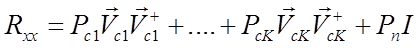

**Собственно-структурный анализ**

ВЧ и СВЧ диапазон характеризуется сложной сигнально помеховой
обстановкой. В частности, одной их проблем диапазона является его
перегруженность. Часто приходится принимать сигнал на фоне нескольких
помех, определить наличие которых по спектру можно не всегда.
Собственно-структурный анализ позволяет определить наличие сигнальных и
шумовых собственных значений. Эта информация может быть важна при
применении некоторых критериев адаптации ААС

Например, если посмотреть на рисунок, то видно, что на третьем блоке
слева имеются две импульсные помехи, которые при данном разрешении по
времени, на сонограмме не видны. Собственные значения в этих местах
значительно возрастают. Также 5,6,7 блок подвержены влиянию помехи,
которая аддитивно воздействует на сигнал. Также по рисунку видно, что
второе собственное значение ВКМ имеет практически постоянное значение,
но значительно превышает по уровню шумовые собственные значения. Это
свидетельствует воздействию широкополосного сигнала, находящегося под
шумом.

ВЧ диапазон характеризуется сложной сигнально помеховой обстановкой.
Одним из способов повышения качества сигнала является реализация
алгоритмов ААС, т.е. взвешивания многоканальных реализаций по различным
критериям. Для взвешивания по критерию МВСМ важно, чтобы первое
собственное значение было сигнальным. Собственно-структурный анализ
позволяет оценить границы применимости критерия МВСМ. Также часто стоит
задача определения числа помех в полосе приема, т.к. некоторые помехи
могут скрываться под шумом. Это может быть важно для критериев,
способных бороться с помехами. В этом случае число помех не должно
превышать число степеней свободы.

{width="16.697916666666668in"
height="10.322916666666666in"}

Данный график отображается только для многоканальных реализаций (\> 1
канала). Для взвешивания многоканальной реализации по критерию МВСМ
необходимо перейти в соответствующий модуль.

**СЗ выборочной корреляционной матрицы**

 

Вспомним, что
{width="2.828472222222222in"
height="0.6284722222222222in"} - структура корреляционной матрицы
выходных сигналов в случае, воздействия на решетку одного полезного
сигнала и шума.

Корреляционная матрица N-элементной АР в случае воздействия на нее К
сигналов и помех

{width="4.371527777777778in"
height="0.5in"} (1.16)

{width="3.2430555555555554in"
height="0.5in"}, (1.17)

N -- размерность матрицы,
{width="0.28541666666666665in"
height="0.4284722222222222in"} - i-ое СЗ матрицы
{width="0.34305555555555556in"
height="0.34305555555555556in"};
{width="0.24305555555555555in"
height="0.4in"} - соответствующий ему СВ;
{width="0.3in"
height="0.28541666666666665in"} - ортогональный базис
{width="0.24305555555555555in"
height="0.24305555555555555in"}

{width="0.7715277777777778in"
height="0.41458333333333336in"};
{width="0.7715277777777778in"
height="0.47152777777777777in"};{width="1.1854166666666666in"
height="0.4in"};{width="1.0in"
height="0.5in"} (1.18)

Как было показано ранее СЗ матрицы
{width="0.24305555555555555in"
height="0.24305555555555555in"}имеют физический смысл мощностей
сигналов, воздействующих на АР. Каждое из СЗ содержит в той или иной
пропорции, составляющие мощностей каждого источника. Как было видно из
частных примеров: в спектре матрицы
{width="0.4in"
height="0.4in"}\[ набор
{width="0.47152777777777777in"
height="0.4in"}\] присутствуют СЗ, которые характеризуют мощности
сигналов и шумов, воздействующих на решетку, и собственные значения,
характеризующие значения только шумов. Таким образом пространство
корреляционной матрицы
{width="0.4in"
height="0.4in"}может быть разделено на так называемое
«сигнально-шумовое» и «шумовое» подпространства.

Анализ собственных значений позволяет выявить воздействие скрытых помех,
находящихся под полезным сигналом или под шумом (например,
широкополосные сигналы).

 
