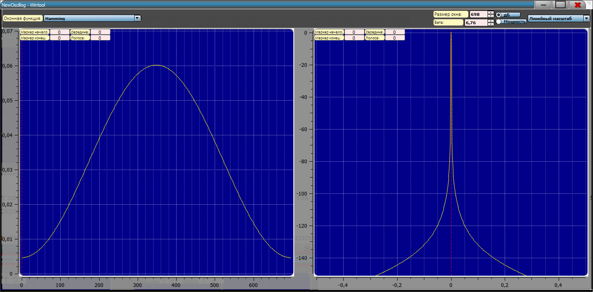
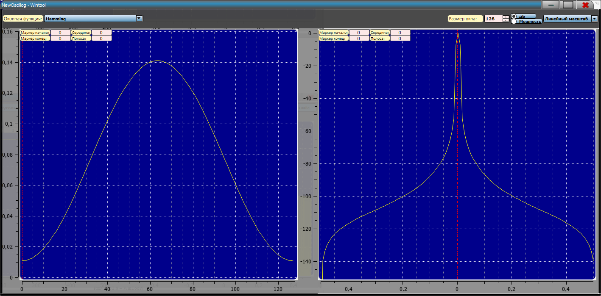

## Спектрально-временной анализ оконных функций

Для того, чтобы включить отображение спектра, необходимо нажать на
кнопку «WinTool» либо на клавиатуре «**CTRL+T**:

{width="14.760416666666666in"
height="7.28125in"}

WinTool

Данная форма позволяет анализировать оконные функции как во временной
области (график слева), так и в частотной области (график справа), в
зависимости от размера окна. Имеется возможность отображать мощность или
Дб, и в логарифмическом или линейном масштабе

**В данном ПО имеется широкий выбор оконных функций:**

-   HAMMING:

{width="14.760416666666666in"
height="7.28125in"}

-   HANN - Hann window max attenuation 44 dB

-   BLACKMAN - Blackman window max attenuation 74 dB

-   RECTANGULAR - Basic rectangular window max attenuation 21 dB

-   KAISER - Kaiser window max attenuation see window::max_attenuation

-   BLACKMAN - HARRIS - Blackman-harris window max attenuation 92 dB

-   BARTLETT - Barlett (triangular) window max attenuation 26 dB

-   FLATTOP - flat top window useful in FFTs max attenuation 93 dB

-   HANNING - Hanning window

-   BLACKMAN2 - Blackman window

-   BLACKMAN3 Blackman window

-   BLACKMAN4 - Blackman window

-   NUTTALL - Nuttall window

-   NuttallContinuous - Nuttall continuous first derivative window

-   WELCH - WELCH window

-   PARZEN - PARZEN window

-   Exponential - exponential window

-   Riemann - exponential window

-   Bartlett_Hann - Bartlett_Hann window

-   Gaussiana1 - Gaussiana1 window

-   Blackman_Nuttall - Blackman_Nuttall window

-   cosine - cosine window

-   Tukey - Tukey window

-   Planck_taper - Planck_taper window

-   Exponential_or_Poisson_D - Exponential_or_Poisson_D window

-   Sinc - Sinc window

-   SquareRootTriangle - The square-root of the Triangle window.

-   DolphChebyshevWindow - Dolph-Chebyshev window
